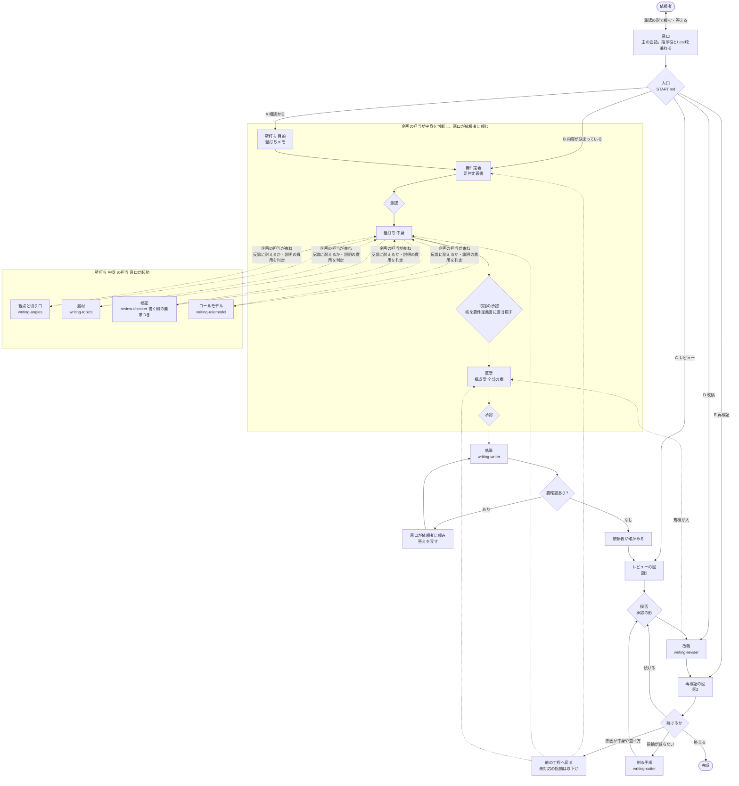
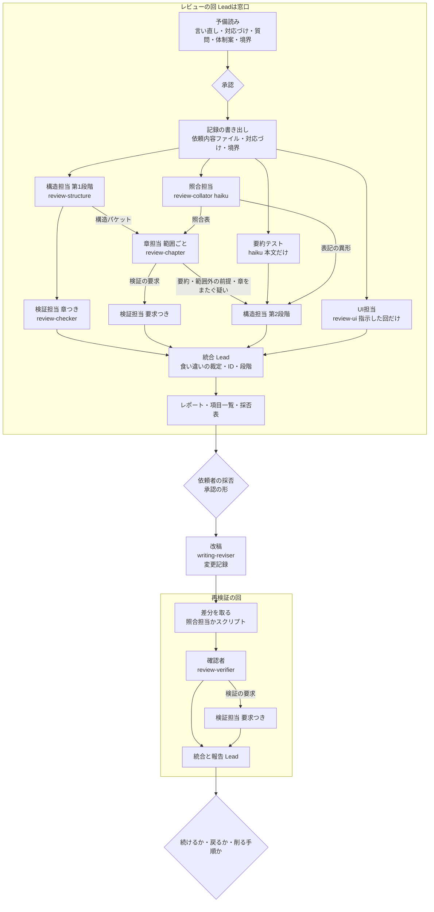

# 文書作成規格 第4版の流れ(2026-11-17 時点)

## 1 全体の流れ(書く手順とレビュー)

```mermaid
flowchart TD
  U([依頼者]) <-->|承認の形で頼む・答える| W[窓口<br>主の会話。指示役とLeadを兼ねる]
  W --> ST{入口<br>START.md}
  ST -->|A 相談から| P0
  ST -->|B 内容が決まっている| P1
  ST -->|C レビュー| RV
  ST -->|D 改稿| RE
  ST -->|E 再検証| VE

  subgraph KIKAKU[企画の担当が中身を判断し、窓口が依頼者に頼む]
    P0[壁打ち 目的<br>壁打ちメモ] --> P1[要件定義<br>要件定義書] --> A1{承認}
    A1 --> P2[壁打ち 中身]
    P2 --> A2{取捨の承認<br>核を要件定義書に書き戻す}
    A2 --> P3[草案<br>構成案 全部の欄] --> A3{承認}
  end

  subgraph CHUMI[壁打ち 中身 の担当 窓口が起動]
    K1[観点と切り口<br>writing-angles]
    K2[題材<br>writing-topics]
    K3[検証<br>review-checker 書く側の要求つき]
    K4[ロールモデル<br>writing-rolemodel]
  end
  P2 -.-> K1 & K2 & K3 & K4
  K1 & K2 & K3 & K4 -.->|企画の担当が束ね<br>反論に耐えるか・説明の費用を判定| P2

  A3 --> M[執筆<br>writing-writer] --> Q{要確認あり?}
  Q -->|あり| QA[窓口が依頼者に頼み<br>答えを写す] --> M
  Q -->|なし| C3[依頼者が確かめる] --> RV

  RV[レビューの回<br>図2] --> D1{採否<br>承認の形}
  D1 --> RE[改稿<br>writing-reviser]
  RE -.->|規模が大| P3
  RE --> VE[再検証の回<br>図2] --> D2{続けるか}
  D2 -->|続ける| D1
  D2 -->|原因が中身や並べ方| BACK[前の工程へ戻る<br>未対応の指摘は取下げ]
  D2 -->|指摘が減らない| CUT[削る手順<br>writing-cutter] --> D1
  D2 -->|終える| END([完成])
  BACK -.-> P1 & P2 & P3
```

## 2 レビューの回と再検証の回

```mermaid
flowchart TD
  subgraph R[レビューの回 Leadは窓口]
    R0[予備読み<br>言い直し・対応づけ・質問・体制案・境界] --> RA{承認}
    RA --> R1[記録の書き出し<br>依頼内容ファイル・対応づけ・境界]
    R1 --> RC[照合担当<br>review-collator haiku]
    R1 --> RS1[構造担当 第1段階<br>review-structure]
    R1 --> RT[要約テスト<br>haiku 本文だけ]
    R1 --> RU[UI担当<br>review-ui 指示した回だけ]
    RS1 -->|構造パケット| RK[章担当 範囲ごと<br>review-chapter]
    RC -->|照合表| RK
    RS1 --> RX[検証担当 章つき<br>review-checker]
    RK -->|検証の要求| RQ[検証担当 要求つき]
    RK -->|要約・範囲外の前提・章をまたぐ疑い| RS2[構造担当 第2段階]
    RT --> RS2
    RC -->|表記の異形| RS2
    RX & RQ & RS2 & RU --> RI[統合 Lead<br>食い違いの裁定・ID・段階]
    RI --> RR[レポート・項目一覧・採否表]
  end
  RR --> UD{依頼者の採否<br>承認の形}
  UD --> REV[改稿<br>writing-reviser<br>変更記録]

  subgraph V[再検証の回]
    V0[差分を取る<br>照合担当かスクリプト] --> V1[確認者<br>review-verifier]
    V1 -->|検証の要求| V2[検証担当 要求つき]
    V1 & V2 --> V3[統合と報告 Lead]
  end
  REV --> V0
  V3 --> UC{続けるか・戻るか・削る手順か}
```
